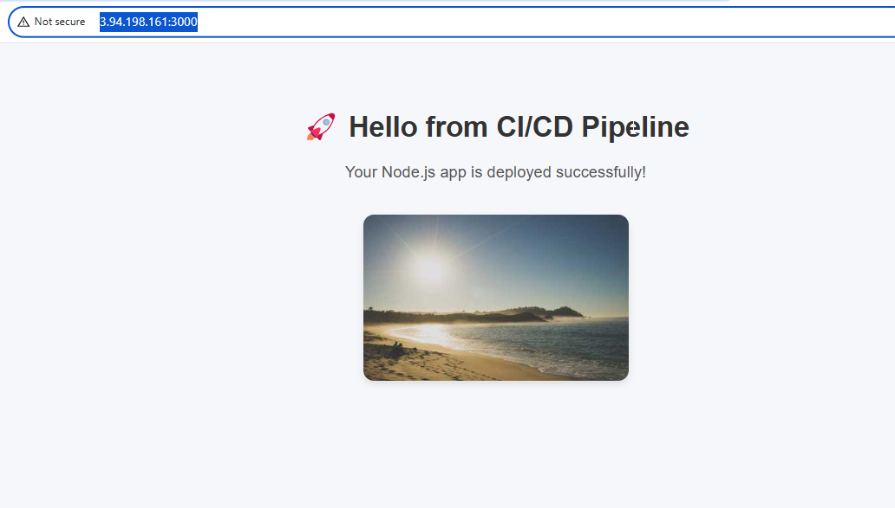

# nodejs-demo-app
This is a Node.js simple application and the 
## 🛠️ Tools Used are 
- **GitHub** – for source code management and Actions (CI/CD)
- **Node.js** – backend runtime environment
- **Express.js** – web framework for Node.js
- **Docker** – containerization of the app
- **Trivy** – security scanning of Docker images
- **AWS EC2** – cloud server to host the Docker container
- **MobaXterm** – SSH client to access the EC2 instance
- **GitHub Secrets** – to securely store credentials for DockerHub and SSH

Created a nodejs-demo-app repo in GitHub and added two sample files,
server.js
----------
const express = require('express');
const app = express();
const PORT = 3000;

app.get('/', (req, res) => {
  res.send('Hello from CI/CD pipeline 🚀');
});

app.listen(PORT, () => console.log(`Server running on http://localhost:${PORT}`));

package.json
=============
{
  "name": "nodejs-demo-app",
  "version": "1.0.0",
  "main": "server.js",
  "scripts": {
    "start": "node server.js",
    "test": "echo \"Running tests...\" && exit 0"
  },
  "dependencies": {
    "express": "^4.18.2"
  }
}

Now, create an EC2 instance and launch it using the Mobaxterm agent to log in to the server using the Public IP and keypair
Install Docker in it 
sudo apt update && sudo apt install -y docker.io
sudo usermod -aG docker $USER

Copy your private key into the ~/.ssh/authorized_keys file using the vi command, and save the file

Now go to the GitHub repo and create a Dockerfile
Dockerfile
=============
~~~
FROM node:18

WORKDIR /usr/src/app

COPY package*.json ./
RUN npm install

COPY . .

EXPOSE 3000

CMD ["node", "server.js"]
~~~
Now go to GitHub settings ==> Secrets and Variables ==> Actions ==> New repository secret
Add your Docker username and password, server public IP, server user, and sand sh-key in key and name format

Now go to Action in the repo and click on “Get started with GitHub Actions”
Click on New workflow / set up a workflow yourself, then it will create the .github/workflows/main.yml file and write the YAML file, and click on commit changes, then the Actions will trigger the pipeline

pipeline explanation
===================

✅ Pipeline Steps Explained:

🧾 Checkout Repository
Downloads the latest code from the main branch of your GitHub repo.

⚙️ Setup Node.js
Installs Node.js version 18 so it can run your app.

📦 Install Dependencies
Installs required packages listed in package.json.

🧪 Run Tests
Executes any test scripts (currently a placeholder in your package.json).

🔐 DockerHub Login
Authenticates to DockerHub using your saved secrets.

🐳 Build Docker Image
Builds a Docker image of your Node.js app.

🛡️ Security Scan (Trivy)
Scans the Docker image for vulnerabilities (CRITICAL & HIGH severity).

📤 Push Docker Image
Pushes the built image to DockerHub.

📦 Deploy to Server (SSH)

Connects to your EC2 server via SSH.

Pulls the latest Docker image.

Stops and removes the old container (if it exists).

Runs the new container on port 3000.
 
 Note:- For reference, see the repo
 ======
After the pipeline was successful, take the public IP of the instance and paste it in the browser as
http://3.94.198.161:3000/

